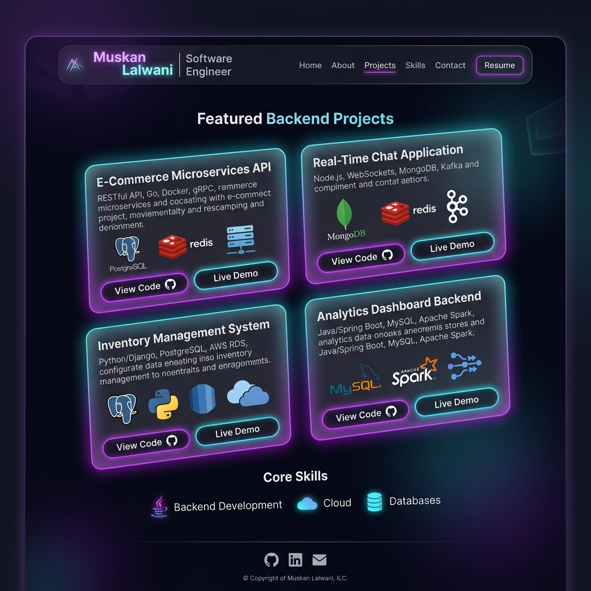

# 🌌 Muskan Lalwani | Software Engineer Portfolio

Welcome to the official repository of my personal developer portfolio. Built with a premium, high-performance dark/light theme, featuring glassmorphism elements, glow effects, smooth scroll animations, and interactive client-side email integration.

---

## 📸 Portfolio Preview



---

## ✨ Features

- 🌓 **Dynamic Theme Toggle**: Seamless dark mode and light mode switch with tailored glassmorphic color palettes.
- 📱 **Fully Responsive Layout**: Built with a mobile-first approach using Tailwind CSS combined with Bootstrap grid frameworks.
- 🚀 **Interactive UI/UX**: 
  - Typing roles animation in the hero section.
  - Hover micro-interactions on links, buttons, and skill tags.
  - Custom scroll animations that reveal sections smoothly.
- 🛠️ **Project Categorization**: Built-in client-side filtering support to toggle between API and Web App categories.
- 📬 **Functional Message Box**: Client-side form validation that automatically prepares a secure email draft to `lmuskan650@gmail.com` using the visitor's native mail client, coupled with a glassmorphism success modal.

---

## 🛠️ Tech Stack

- **Core**: HTML5, Vanilla JavaScript (ES6+), TypeScript
- **Styling & Components**: Bootstrap 5, Tailwind CSS
- **Icons & Typography**: Bootstrap Icons, Google Fonts (Inter, Outfit, JetBrains Mono)
- **Deployment**: Configured for instant deployment via GitHub Pages

---

## 📂 Project Structure

```bash
muskan_lalwani_portfolio/
├── assets/
│   └── screenshot.png       # Portfolio visual preview
├── index.html               # Main single-page application
├── profile.jpg              # Local profile picture
└── README.md                # Project documentation
```

---

## 🚀 Running Locally

To run the project on your local machine, clone the repository and start a local HTTP server:

```bash
# 1. Clone the repository
git clone https://github.com/Smilems2/portfolio_website.git

# 2. Navigate to the project directory
cd portfolio_website

# 3. Start a local server (Python 3)
python3 -m http.server 5500
```
Open your browser and navigate to: **`http://localhost:5500`**

---

## 🌐 Deploy to GitHub Pages

Host this portfolio for free in just a few clicks:
1. Go to your repository settings page on GitHub.
2. Under **Code and automation**, click **Pages**.
3. Under **Branch**, select **`main`** and folder **`/ (root)`**.
4. Click **Save**.
5. Your portfolio will be live at: **`https://Smilems2.github.io/portfolio_website/`**

---
*Created by Muskan Lalwani | 2025*
